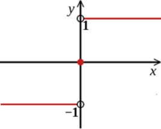

# 学习笔记

## 1. 模型评价指标

|                             | 相关（Relevant），正类 | 无关（NonRelevant），负类 |
| --------------------------- | ---------------------- | ------------------------- |
| 被检索到（Retrieved）       | true positives（TP）   | false positives（FP）     |
| 未被检索到（Not Retrieved） | false negatives（FN）  | true negatives（TN）      |

召回率（recall，查全率）：检索到正确的数目 / 所有正确的数目（$\frac{TP}{TP+FN}$）

精度（precision，查准率）：检索到正确的数目 / 所有检索的数目（$\frac{TP}{TP+FP}$）

准确率（accuracy）：判断正确的数目 / 总数（$\frac{TP+TN}{TP+FP+FN+TN}$）

F-Measure值（综合平均指标）：正确率和召回率的调和平均值（$\frac{(a^2+1) * P* R}{a^2(P+ R)}$）

​							  当$a=1$时，$F1=\frac{2* P* R}{P+ R}$

> 调和平均数（倒数平均数）：总体各统计变量倒数的算术平均数的倒数 。  公式如下：
>
> $ H=\frac{n}{\frac{1}{x_1}+\frac{1}{x_2}+\ldots+\frac{1}{x_n}} $
>
> 或
>
> $ H = \frac{n}{\sum_{i=1}^{n}{\frac{1}{x_{i}}}} $

## 2. TensorFlow函数

1. `tf.argmax(input, axis=None, name=None, dimension=None)`：求input中每行（axis=1）或每列（axis=0）的最大值
2. tf.reduce_max(input, axis=None, )
3. tf.reduce_mean()
4. tf.reduce_sum()
5. tf.softmax
6. tf.layers.dropout()
7. tf.transpose()
8. tf.nn.embedding_lookup()

## 3. ML和DL中常见函数

#### 3.1 `sign()`

符号函数。  

 $sign(x)= \begin{cases} 1, & \text {if $x>0$} \\ 0, & \text{if $x=0$} \\ -1, & \text { if $x<0$ } \end{cases}$ ，图如下：

#### 3.2 高斯函数

$f(x)=ae^{\frac{-(x-b)^2}{2c^2}}$

其中，$a，b，c$为实数常熟，且$a>0$

## 4. ACE(Automatic Content Extraction)

#### 4.1 研究目标

ACE研究目标被视为实体、关系、事件的检测和表征(characterization)

ACE三个主要的标注任务对应三个研究目标：

1. 实体检测和追踪（EDT）
2. 关系检测和表征（RDC）
3. 事件检测和表征（EDC）

#### 4.2 实体检测和追踪（EDT）

核心标注任务，其他任务的基础。

被标志为7种实体类：Person、Organization、Location、Facility、Weapon、Vehicle、Geo-political Entity。

每种类下都有子类。

#### 4.3 关系检测和表征（RDC）

物理关系，包括：Located，Near，Part-Whole；

社会/任务关系，包括：Business，Family，Other；

一系列就业或人员关系；

工件与代理商之间的关系（包括所有权）;

从属关系，如种族；

人与地区之间的关系，如国籍；

话语关系；

## 5. Distant Supervision

#### 5.1 Freebase

大语义数据库。

116,000,000个实例；7,300种关系；9,000,000个实体。

#### 5.2 训练数据

1,200,000篇维基百科文章；1,800,000个实例；102个关系；940,000个实体。

这些数据是Freebase数据经过一些基本的处理之后的数据，如过滤掉nameless和不感兴趣的实体，并且合并了相反的关系（book-author v. author-book）。

#### 5.3 优点

1. 这个算法由数据库监督，而不是带标签的文本，因此不会遇到困扰监督系统的过拟合和域依赖问题
2. 训练过程中，有相同的三元组（relation, entity_1, entity_2）的特征将会结合在一起，变成一个更丰富的特征向量
3. 能够结合来自同一关系的许多被提及的信息
4. 单独一句话中的实体间的关系是含糊不确定的，但是当拥有相同实体的句子结合起来，关系就能够确定了

#### 5.4 特征

###### 5.4.1 词法特征

描述句子中两个实体词之间和周围的具体的词：

1. 两个实体间单词序列
2. 这些词的词性标签
3. 指明哪个实体在句子前面的标志
4. 实体1左侧k个单词的窗口及他们的词性标签
5. 实体2右侧k个单词的窗口及他们的词性标签

每个词法特征都有这些成分的组合构成。

词性标签简化成7类：nouns、verbs、adverbs、adjectives、numbers、foreign words、everything else。

###### 5.4.2 句法特征

有下列成分的组合构成：

1. 两个实体间的依存路径
2. 对每个实体来说，一个“窗口”节点不属于依存路径

###### 5.4.3 命名实体标签特征

使用斯坦福4类命名实体标注器来进行命名实体标注。

这个标注器给每个单词提供{person、location、organization、miscellaneous、none}中的一个标签。

#### 5.5 构造训练集

在这里，训练集的构造相当于一个多类逻辑回归分类器的训练。

###### 5.5.1 relation和初始特征向量

使用Freebase提取出一些relation，和relation instance（<relation, entity_1, entity_2>）及relation instance对应的feature vector（不完全）。

关系抽取主要使用的训练集就是feature vector，但是由于我们使用的Freebase数据少，因此需要丰富feature vector，这就轮到distant supervision登场了。

distant supervision根据已有的不充分数据，从无标签文本中提取出features vectors来丰富已有的feature vector。

因为这里我们只有正例而无反例，因此需要人为地构造反例。

###### 5.5.2 训练步骤

文本数据集中的语句（没有标签的），简单分析获得词法特征，使用broad-coverage dependency parser获得语法特征，使用 Stanford four-class name entity tagger获得命名实体标签特征。每一句的命名实体组成命名实体对，如果和Freebase中的相同，则就认为他们有相同的relation。将获得的特征添加到原始的特征中从而得到一个更加丰富的特征。

###### 5.5.3 测试步骤

一个实体对可能出现在多个句子中，从这些句子提取出来的向量结合起来，一起来预测这个实体对的relation。

#### 5.5 评估

两种评估方法：

1. 自动化方法：训练时留出了一部分数据，将这些数据和测试运行结果进行对比
2. 人工方法：让人查看每个正面标记的实体对，并标记参与者之间的关系是否的确存在